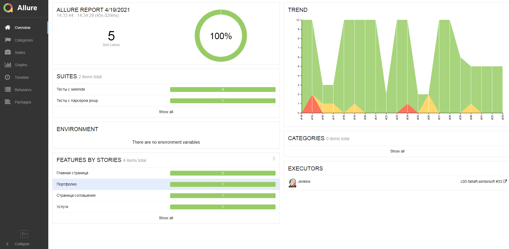
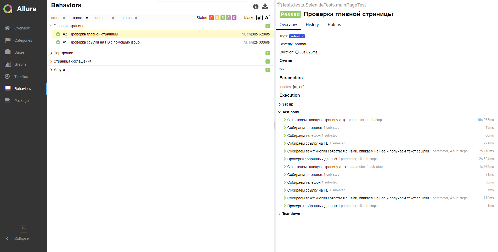
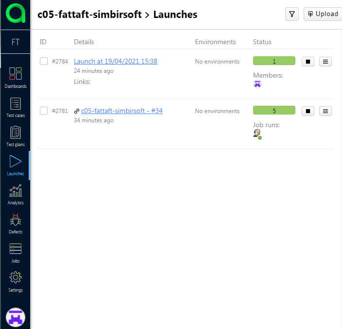
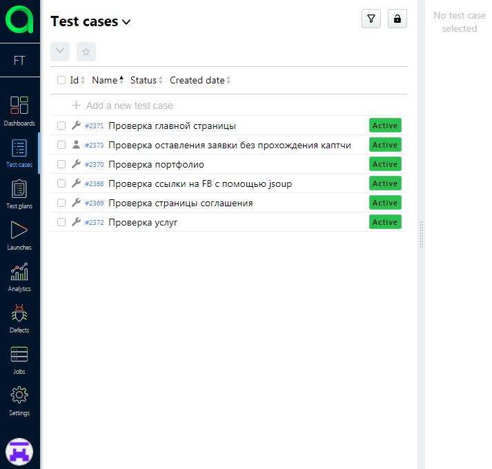
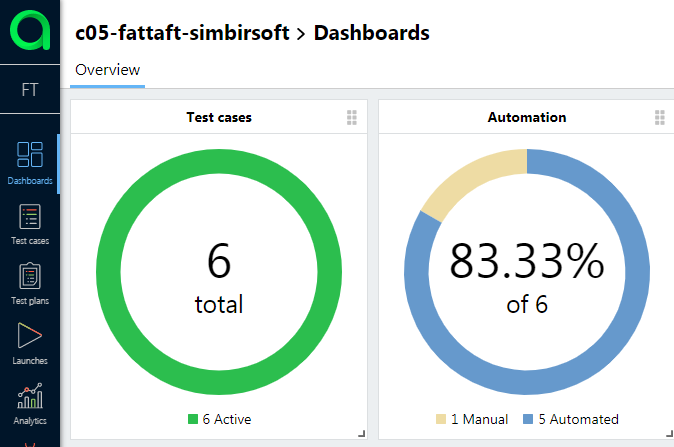
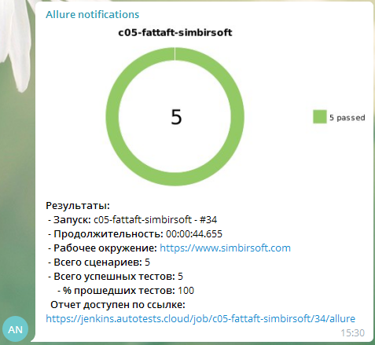

# Тестируем веб-сайт
https://www.simbirsoft.com/

# Используемые технологии
Java, Gradle, JUnit5, jsoup, Selenide, Allure reports, Allure TestOps, Selenoid, Allure-notifications

# Описание
Создано несколько автоматизированных UI тестов с использованием Selenide.

Добавлен пример теста без запуска браузера с использованием html парсера jsoup (такие тесты легче и проходят быстрее).

- Тесты запущены из CI системы Jenkins
- Для контейнеризации selenide тестов использован Selenoid
- Тесты были запущены в параллельном режиме (3 потока)
- Сгенерирован отчет Allure reports (к тестам, пройденным в Selenoid прикладывается видео)
- Отчет загружен в Allure TestOps
- Автоматически созданы тест-кейсы для автоматизированных тестов
- В Allure TestOps добавлен ручной тест для наглядности  
- Уведомление с отчетом о прохождении тестов отправлено в telegram

# Скриншоты и видео

## Отчет Allure reports
### Общий отчет

### Отчет по тесту

### Видео прохождения UI тестов

## Allure TestOps
### Запуски

- **id #2784** - Прохождение ручного тест-кейса
- **id #2781** - Прохождение автоматизированных тест-кейсов

### Тест-кейсы

- **id #2373** - Ручной тест-кейс

Все остальные - автоматически созданные после запуска из Jenkins

### Allure TestOps Dashboard

Здесь видно сколько всего тест-кейсов и сколько из них автоматизированно

## Уведомление в telegram

## Ссылки
### Jenkins
https://jenkins.autotests.cloud/job/c05-fattaft-simbirsoft/
### Allure reports
https://jenkins.autotests.cloud/job/c05-fattaft-simbirsoft/34/allure

